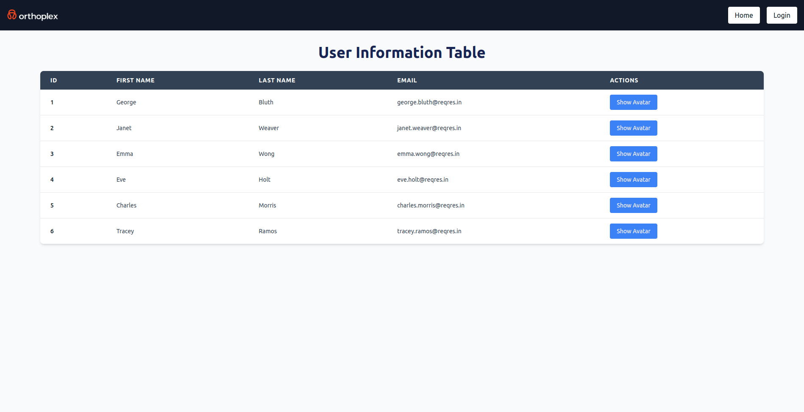

# Orthoplex Dashboard

- This React.js application features a login page and a responsive dashboard, showcasing data fetched from an API. With a clean UI, authentication, and seamless navigation via a responsive navbar, the app delivers a user-friendly experience across devices. It leverages modern React tools like Context and Axios to meet essential development challenges.



## Demo

<a href="https://orthoplex-task.netlify.app/" target="_blank">Live Demo</a>

## Features

- **User Management:**

  - Fetch and display user data dynamically.
  - View user details in a responsive table.
  - Display user avatars with a modal dialog feature.

- **Authentication:**

  - Login page with authentication flow.
  - Use predefined credentials to access the application.

- **Responsive Design:**
  - Optimized for various screen sizes (mobile, tablet, and desktop).
  - Provides a seamless user experience across all devices.

- **Dynamic Credentials Reveal:**
  - A flipping card to reveal login credentials for testing purposes.
  - Copy functionality for email and password.

## Getting Started

### Prerequisites

Ensure you have the following software installed on your machine:

- [Node.js]
- [npm package]

### Installation

1. Clone the repository:

```
git clone https://github.com/Mohamed-Elwakeel/orthoplex-task.git
```

2. Navigate to the project directory:

```
cd orthoplex-task
```

3. Install dependencies:

```
npm install
```

4. Start the development server:

```
npm start
Open your browser and visit http://localhost:3000.
```

Navigate to the Sign In, Sign Up, and Home pages to start managing your todos!

# Technologies Used

- React.js: A JavaScript library for building user interfaces.
- React Router: Declarative routing for React.js applications.
- Context API: For managing global state.
- Axios: For fetching data from APIs.
- Tailwind CSS: Utility-first styling for responsive design.
- React Hook Form: Form management and validation.
- React Toastify: For displaying notifications.
